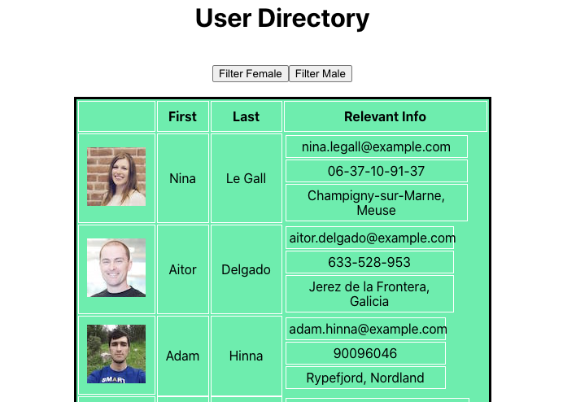

# User Directory

## This app is deployed on Heroku https://user-directory-ads.herokuapp.com/

### Collaborated with https://github.com/ReindeerCode

## License

## Project Description

This project uses react and a random user API. When the page loads, 20 random user's profiles populate a table. You are able to sort the table alphabetically by last and first name. You can also filter a random use based on their gender with the buttons.

## Github Username

https://github.com/arensalmela

## Github Repository

https://github.com/arensalmela/User-Directory

## Screenshot

